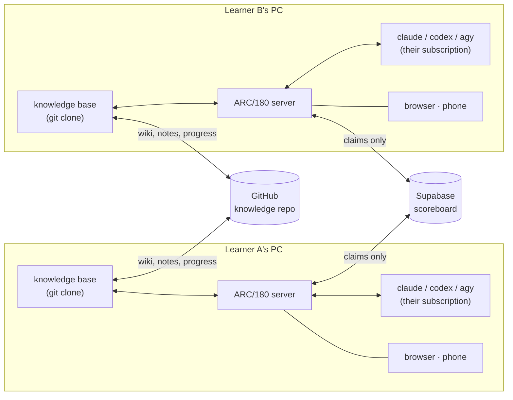

# ARC/180

**A study tracker that turns a markdown knowledge base into a two-player race.**

Two people work through the same 180-day curriculum. ARC/180 reads that curriculum
straight from their shared knowledge-base repo — no database, no admin panel, no
content duplicated anywhere — and turns it into a daily mission, a calendar, a
streak, and a live scoreboard between the two of them.

It also talks to the knowledge base: the chat screen runs your installed AI CLI
(Claude Code, Codex, or Antigravity) headless against the repo, so answers are
grounded in your actual notes and cite the files they came from.

Python standard library only. No `pip install`, no build step, no framework.

---

## Why it works this way

**The knowledge base is the database.** The curriculum lives in markdown files that
humans and LLMs already read and edit. Copying it into a database would create a
second source of truth that drifts. Instead the server parses the repo on every
request — edit a schedule file, refresh the page, the change is there.

**Each person runs their own copy.** Both learners run this server on their own
machine, against their own clone, using their own AI subscriptions. Nobody's
laptop is a dependency for anybody else, and AI chat logs never leave the machine
that produced them.

**Only pointers are shared.** Supabase holds two small tables: who finished which day,
and a doorbell row saying "I just pushed, here's my HEAD". That is the entire cloud
surface, and nothing private is in it. The knowledge itself travels the way it always
did — through git.

**Sync is event-driven, never scheduled.** A daily-check cron loses whatever you wrote
in the afternoon. Instead the server watches the knowledge base, and about two minutes
after it stops changing it commits, pulls with rebase, and pushes — then rings the
doorbell so the other machine pulls at once instead of waiting for a timer. Conflicts
are never auto-resolved: the rebase is aborted, the app shows a banner, and a human
decides. If the knowledge base's own pre-commit checks reject the commit, syncing
pauses and surfaces the error rather than forcing it through.



---

## Screens

**Overview** — today's topic and deliverable pulled from the curriculum, a checklist
that mirrors the day's subtasks if the knowledge base defines them, your streak and
XP, and a 180-day rail with both players' markers on it.

**Calendar** — the month with one topic per day. Two dots per cell: filled when that
person finished, hollow red when they missed it, faint when it hasn't happened yet.

**Arena** — head-to-head XP, levels, weekly duels (whoever earned more XP that week
takes it), and badges that unlock from real conditions.

**Notes** — a scratch pad wired straight to `people/<you>/notes/<date>.md` in the
knowledge base. Type here, the markdown file changes. Edit the file, refresh, it's
here. Beside it, a feed of what changed in the repo recently.

**AI Chat** — conversations grounded in the repo. Each conversation is one persistent
CLI session that lasts the whole study day, so follow-ups keep their context instead
of starting cold.

---

## The interesting part: persistent AI CLI sessions

Every provider does session continuity differently, and one of them doesn't expose
it at all. What ARC/180 does per provider:

| Provider | Start a session | Continue it |
| --- | --- | --- |
| Claude Code | `claude -p … --session-id <uuid> --append-system-prompt <grounding>` | `claude -p … --resume <uuid>` |
| Codex | `codex exec --json …`, then read `thread_id` from the `thread.started` event | `codex exec resume <thread_id> …` |
| Antigravity (`agy`) | `agy -p …`, then diff `~/.gemini/antigravity-cli/brain/` before and after the run | `agy --conversation <id> -p …` |

Notes from making this work, in case they save someone else the afternoon:

- **Antigravity's print mode never prints its conversation ID**
  ([antigravity-cli#7](https://github.com/google-antigravity/antigravity-cli/issues/7)),
  and `--continue` grabs the most recent conversation globally, which cross-contaminates
  concurrent callers. Snapshotting the `brain/` directory around the first call is the
  only reliable way to learn the ID a headless run created.
- **Codex blocks on inherited stdin.** Spawned with an open pipe it prints
  "Reading additional input from stdin…" and waits forever. Every CLI here is launched
  with stdin closed.
- **Codex's `--sandbox` flag is rejected by `exec resume`** — the same setting has to
  be passed as `-c sandbox_mode="…"` on that subcommand.
- **Grounding belongs in the system prompt, not the message.** Prepending instructions
  to the user's text works until the model is asked to quote the previous question and
  recites the whole preamble back.

---

## Setup

Requires Python 3.9+ and a knowledge-base repo laid out like the one described below.

```bash
git clone <this repo> arc180
cd arc180
cp arc180.local.example.json arc180.local.json
#   edit arc180.local.json: kb_path, the two user names, port, and (optionally)
#   your Supabase project URL + anon key
python server.py
```

Open the printed URL. To install it as an app, use your browser's *Install* option
(needs HTTPS or localhost — over plain LAN HTTP, "Add to home screen" still works).

For the shared scoreboard, create a Supabase project and run [`supabase.sql`](supabase.sql)
once in its SQL editor. Leave the Supabase values empty in your config and the app
runs fully offline, showing only your own side.

**Nothing personal lives in this repository.** Paths, names, ports, plan dates and
keys all come from `arc180.local.json`, which is git-ignored, as is `data/` — the
folder holding claims and AI chat logs.

### What the knowledge base must look like

```
<knowledge-base>/
├── whoami.local.md            # git-ignored; `user: <name>` says who this machine belongs to
├── schedule/…/week-NN-*.md    # the curriculum: "### Mon Jul 6 — Topic" per weekday,
│                              #   "## Saturday — …" for build days
└── people/<name>/
    ├── progress/week-NN.md    # "## Mon Jul 6 — Topic [status: done]" + "- [x] subtask"
    └── notes/<date>.md        # written by the app
```

The layout comes from the [LLM Wiki](https://karpathy.bearblog.dev/) pattern plus
Google's Open Knowledge Format — one concept per markdown file, small YAML
frontmatter, links as plain markdown. Any repo following that shape will work;
the parsers are in `load_schedule()` and `load_progress()`.

Two details the app respects rather than fights. The roster is simply whichever
`people/<name>/` folders exist, so nobody configures names and both machines always
agree — and no scoreboard value is positional, so there is no slot to claim. Notes
are written with OKF frontmatter (`type: progress`, reusing the knowledge base's own
vocabulary rather than inventing one) so they pass the repo's lint on commit; the
editor shows only the body and preserves any frontmatter you add by hand.

---

## Scoring

Scoring starts at `season_start`. Days before it stay in the knowledge base and on
the calendar as real history but earn nothing, so a second learner joining a month
late still starts level with everyone else — no history is rewritten to make that
true. 50 XP for a weekday task, 100 for a Saturday build. Ranks every ~300 XP, from
Apprentice to Principal Architect. A streak counts consecutive *scheduled* days
finished — Sundays aren't scheduled, so they don't break it. A day counts as done
when it's marked `[status: done]` in the knowledge base **or** claimed in the app;
the app writes its own claims to `data/` and never edits progress files, which stay
owned by whatever ritual maintains the knowledge base.

## Status

Working: curriculum parsing, claims, streaks, XP, calendar, arena, two-way notes,
AI chat with persistent sessions, Supabase scoreboard with realtime updates,
event-driven git sync of the knowledge base, PWA install and offline shell.

Planned: a week-in-review screen, and editing progress subtasks from the app.

## License

MIT — see [LICENSE](LICENSE).
